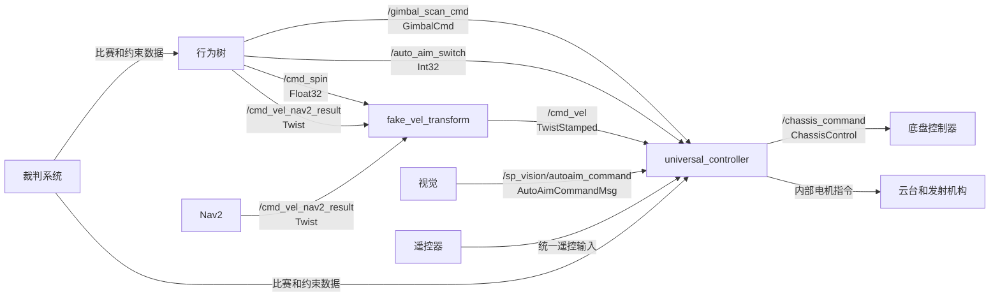

# 哨兵行为树接口文档

> 用途：供行为树、比赛控制器迁移、导航、视觉和底盘成员共同确认接口。
>
> 范围：当前 `27UL_Sentry_ws` 固定版本中的实车链路；本文描述现状，不把旧代码的行为当作 2027 比赛策略。

## 1. 一张图看清调用链



`universal_controller` 是硬件前最后一层仲裁。行为树成功发布 topic，只说明消息已发出，不能说明云台或底盘一定采用了该消息。

## 2. 组件职责与控制权

| 组件 | 职责 | 不应承担的职责 |
| --- | --- | --- |
| `behavior` | 根据比赛状态和输入选择行为，发送高层动作指令 | 直接控制电机、绕过底盘仲裁 |
| `pb2025_sentry_nav` | 定位、路径规划、速度坐标转换 | 决定比赛策略 |
| `fake_vel_transform` | 将导航速度转换为底盘可接收的 `TwistStamped` | 决定是否允许运动 |
| `universal_controller` | 仲裁遥控、导航、扫描、自瞄并下发硬件命令 | 比赛层任务规划 |
| `sp_vision_25_rosy` | 提供自瞄目标的 yaw、pitch、锁定状态 | 决定何时允许发射 |
| 比赛控制器 C++ 迁移 | 比赛状态机与流程迁移 | 与行为树同时发布同一套底层动作 |

当前分工建议：比赛控制器迁移同学拥有比赛状态机；行为树同学拥有行为树节点、调用、中断与决策链路。双方共同确认 topic、消息类型、启动顺序和最终控制权。

## 3. 行为树发出的命令

| Topic | 类型 | 发布者 | 订阅者 | 含义 | 测试时必须确认 |
| --- | --- | --- | --- | --- | --- |
| `/gimbal_scan_cmd` | `pb_rm_interfaces/msg/GimbalCmd` | `PublishGimbalVelocity`、`PublishGimbalAbsolute` | `universal_controller` | 云台扫描速度、角度范围或绝对角度 | 消息频率小于 0.5 s 间隔；Hub 已选中扫描；云台实际运动和限位正确 |
| `/auto_aim_switch` | `std_msgs/msg/Int32` | `PublishAutoAim` | `universal_controller` | `0` 禁止、非 `0` 允许导航侧自瞄发射门控 | 它只控制门控，不产生视觉目标，也不单独开启自瞄 |
| `/cmd_spin` | `example_interfaces/msg/Float32` | `PublishSpinSpeed` | `fake_vel_transform`、`universal_controller` | 外部小陀螺输入 | 实测单位和安全范围；导航底盘模式下 Hub 会忽略这个外部旋转输入 |
| `/cmd_vel_nav2_result` | `geometry_msgs/msg/Twist` | Nav2；行为树的 `PublishTwist` 经 launch 重映射后也发往这里 | `fake_vel_transform` | 未转换的导航速度 | 不应直接连接硬件控制器 |
| `/cmd_vel` | `geometry_msgs/msg/TwistStamped` | `fake_vel_transform` | `universal_controller` | 经过云台朝向补偿后的导航速度 | 消息类型必须是 `TwistStamped`，且小于 0.2 s 旧 |

### 3.1 `GimbalCmd` 的关键字段

```text
std_msgs/Header header

uint8 ABSOLUTE_ANGLE = 1
uint8 VELOCITY = 2
uint8 yaw_type
uint8 pitch_type

Gimbal position  # pitch, yaw
Gimbal velocity  # pitch, yaw, 各自 min/max range
```

扫描节点使用 `yaw_type=VELOCITY` 和 `pitch_type=VELOCITY`，并填写：

```text
velocity.yaw
velocity.pitch
velocity.yaw_min_range / velocity.yaw_max_range
velocity.pitch_min_range / velocity.pitch_max_range
```

范围单位和速度单位按节点注释为弧度、弧度每秒；第一次实车测试必须以保守速度和窄范围开始。

## 4. 来自视觉、导航和底盘的接口

| Topic | 类型 | 发布者 | 订阅者 | 说明 |
| --- | --- | --- | --- | --- |
| `/sp_vision/autoaim_command` | `sp_msgs/msg/AutoAimCommandMsg` | `sp_vision_25_rosy` | `universal_controller` | 包含 `timestamp`、`control`、`shoot`、`yaw`、`pitch`。`control=false` 或消息超过 0.2 s 时，Hub 不采用自瞄。 |
| `/odometry` | `nav_msgs/msg/Odometry` | `sensor_scan_generation` | `fake_vel_transform`、导航组件 | 用于速度坐标转换与导航定位。 |
| `local_plan` | `nav_msgs/msg/Path` | Nav2 controller | `fake_vel_transform` | 用于判断 Nav2 控制器是否活跃。 |
| `/chassis_command` | `chassis_controllers/msg/ChassisControl` | `universal_controller` | `chassis_controllers` | 最终底盘命令观察点。行为树不要直接发布它。 |
| `/universal_controller/input/vtm` | `universal_controller/msg/UnifiedInput` | VTM 遥控解释器 | `universal_controller` | 遥控输入来源之一。 |
| `/universal_controller/input/ndj` | `universal_controller/msg/UnifiedInput` | NDJ 遥控解释器 | `universal_controller` | 遥控输入来源之一。 |

`ChassisControl` 主要字段：

```text
x_speed, y_speed, spin_speed
emergency_stop, power_limit
extra_info
```

这条消息用于观察 Hub 最终下发的结果。例如行为树要求停车，应该同时检查 `/cmd_vel_nav2_result`、`/cmd_vel` 和 `/chassis_command` 是否都变为零。

## 5. 行为树订阅的数据

行为树服务器会把下列消息复制到全局 Blackboard，供条件节点和决策节点读取。

| Topic | 类型 | Blackboard key | 用途 |
| --- | --- | --- | --- |
| `/referee/common/game_status` | `dji_referee_protocol/msg/GameStatus` | `referee_gameStatus` | 开赛、结束和剩余时间 |
| `/referee/common/robot_hp` | `dji_referee_protocol/msg/RobotHP` | `referee_robotHP` | 血量策略 |
| `/referee/common/robot_performance` | `dji_referee_protocol/msg/RobotPerformance` | `referee_robotPerformance` | 机器人性能状态 |
| `/referee/common/robot_heat` | `dji_referee_protocol/msg/RobotHeat` | `referee_robotHeat` | 热量策略 |
| `/referee/common/robot_position` | `dji_referee_protocol/msg/RobotPosition` | `referee_robotPosition` | 裁判位置数据 |
| `/referee/common/allowed_shoot` | `dji_referee_protocol/msg/AllowedShoot` | `referee_allowedShoot` | 射击许可 |
| `/referee/common/rfid_status` | `dji_referee_protocol/msg/RFIDStatus` | `referee_rfidStatus` | 场地区域状态 |
| `/referee/common/field_event` | `dji_referee_protocol/msg/FieldEvent` | `referee_fieldEvent` | 场地事件 |
| `/referee/common/robot_buff` | `dji_referee_protocol/msg/RobotBuff` | `referee_robotBuff` | 增益状态 |
| `/referee/common/ground_robot_position` | `dji_referee_protocol/msg/GroundRobotPosition` | `referee_groundRobotPosition` | 地面机器人位置 |
| `/referee/parsed/common/constraints` | `dji_referee_protocol/msg/Constraints` | `referee_constraints` | 热量、功率、射击等约束 |
| `/referee/parsed/common/self_color` | `dji_referee_protocol/msg/SelfColor` | `referee_selfColor` | 己方阵营 |
| `/referee/common/damage_state` | `dji_referee_protocol/msg/DamageState` | `referee_damageState` | 受击事件；只在 Blackboard 保留一个行为树 tick |
| `/manual_start` | `std_msgs/msg/Int32` | `manual_start` | 手动启动测试树 |
| `detector/armors` | `auto_aim_interfaces/msg/Armors` | `detector_armors` | 装甲板检测 |
| `tracker/target` | `auto_aim_interfaces/msg/Target` | `tracker_target` | 追踪目标 |
| `global_costmap/costmap` | `nav_msgs/msg/OccupancyGrid` | `nav_globalCostmap` | 攻击点、避障等导航决策 |

## 6. Hub 的仲裁规则

这是第一阶段最容易误判的部分。

| 子系统 | 条件 | Hub 采用的输入 |
| --- | --- | --- |
| 全部硬件 | 遥控输入不存在、断连或急停 | Hub 急停底盘、云台、发射机构 |
| 底盘 | `navigation_enabled=true` 且 `/cmd_vel` 新鲜 | 导航速度 |
| 底盘 | 其他情况 | 遥控速度 |
| 云台 | `navigation_enabled=true`、`/auto_aim_switch` 允许、遥控允许自瞄、视觉锁定且新鲜 | 自瞄 |
| 云台 | `navigation_enabled=true`，但不满足自瞄条件，且扫描命令新鲜 | 扫描 |
| 云台 | 非导航模式 | 自瞄优先，否则遥控 |
| 发射 | 当前实现 | 遥控触发；全自主条件下还会检查自瞄与 `/auto_aim_switch` 门控 |

因此，云台扫描测试前必须确认：遥控在线、未急停、已经进入导航模式。若这些条件不满足，行为树的扫描消息会存在，但 Hub 不会选中它。

## 7. 坐标与速度约定

| 名称 | 作用 | 注意事项 |
| --- | --- | --- |
| `map` | 全局导航与全局代价地图 | 固定路线和攻击点使用前先确认场地原点和朝向 |
| `odom` | 局部连续里程计 | 与 `map` 的关系由定位模块维护 |
| `gimbal_yaw` | 实车导航参考坐标系 | 反映云台朝向相关的底盘参考 |
| `gimbal_yaw_fake` | Nav2 使用的辅助坐标系 | `fake_vel_transform` 维护其与 `gimbal_yaw` 的关系 |
| `/cmd_vel_nav2_result` | 导航速度输入 | 类型为 `Twist` |
| `/cmd_vel` | 供 Hub 使用的导航速度 | 类型为 `TwistStamped`，已做云台朝向补偿 |

禁止只修改 Pose 的 `frame_id` 来“转换坐标系”。必须通过 TF 进行实际变换，并在 TF 不可用时报告失败。

## 8. 行为树启动接口

行为树服务器提供 ROS 2 Action：

```text
action name: /pb2025_sentry_behavior
action type: btcpp_ros2_interfaces/action/ExecuteTree
goal field: target_tree
```

当前 ROS 包为 `behavior`。启动文件创建 `behavior_server` 和
`behavior_client` 两个节点，分别运行同名可执行文件。YAML 顶层节点键与这两个
节点名对应；插件和行为树资源分别从 `behavior/bt_plugins` 和
`behavior/behavior_trees` 加载。Action 名沿用 `/pb2025_sentry_behavior`。

在工作区完成编译并加载环境：

```bash
cd /home/soyo/sentry_ws
source /opt/ros/humble/setup.bash
source install/setup.bash
colcon build --paths src/behavior --packages-select behavior \
  --cmake-args -DBUILD_TESTING=OFF
source install/setup.bash
```

默认配置执行 `competition_phase1`：

```bash
ros2 launch behavior pb2025_sentry_behavior_launch_new.py
```

通过 `params_file` 选择测试配置：

```bash
ros2 launch behavior pb2025_sentry_behavior_launch_new.py \
  params_file:=/home/soyo/sentry_ws/src/behavior/params/sentry_behavior_conditions_test.yaml
```

| 参数文件 | 执行的行为树 | 用途 |
| --- | --- | --- |
| `sentry_behavior_phase1.yaml` | `competition_phase1` | 完整流程 |
| `sentry_behavior_conditions_test.yaml` | `competition_test_conditions` | 观察血量与热量判断 |
| `sentry_behavior_combat_test.yaml` | `competition_test_combat` | 战斗阶段 |
| `sentry_behavior_retreat_test.yaml` | `competition_test_retreat` | 撤退阶段 |
| `sentry_behavior_recover_test.yaml` | `competition_test_recover` | 恢复阶段 |

四个测试配置通过 `/manual_start` 控制。启动测试：

```bash
ros2 topic pub --once /manual_start std_msgs/msg/Int32 '{data: 1}'
```

撤销启动条件：

```bash
ros2 topic pub --once /manual_start std_msgs/msg/Int32 '{data: 0}'
```

`1` 启动测试，`0` 撤销启动条件。条件测试用于观察输入和判断结果；战斗、撤退、
恢复测试会发布控制命令。完整流程按裁判比赛状态运行。

## 9. 第一次实车联调记录

每次测试建议记录以下信息，避免只凭“看起来动了”判断。

| 项目 | 需要保存的证据 |
| --- | --- |
| 代码版本 | 工作区提交、行为树子模块提交、参数文件名 |
| 运行前置条件 | 遥控连接状态、是否急停、导航模式和自瞄模式开关位置 |
| 行为树状态 | Action 是否接收所选行为树，服务器日志和反馈 |
| 云台扫描 | `/gimbal_scan_cmd` 的 `ros2 topic hz`、云台运动视频或关节反馈 |
| 自瞄 | `/auto_aim_switch` 与 `/sp_vision/autoaim_command` 的当前值和频率 |
| 底盘静止 | `/cmd_vel_nav2_result`、`/cmd_vel`、`/chassis_command` 的零值证据 |
| 停止测试 | 取消 Action 或撤销启动条件后的停止时间、是否残留扫描或转动 |

建议命令：

```bash
ros2 action list -t
ros2 action info /pb2025_sentry_behavior
ros2 topic info --verbose /gimbal_scan_cmd
ros2 topic hz /gimbal_scan_cmd
ros2 topic echo --once /cmd_vel
ros2 topic echo --once /chassis_command
ros2 topic echo --once /sp_vision/autoaim_command
ros2 run tf2_ros tf2_echo map gimbal_yaw_fake
```

## 10. 当前待确认项

1. 云台真实位置/速度反馈的 topic、消息类型和可接受误差；现有行为树只有命令接口，没有动作完成反馈接口。
2. `/cmd_spin` 的真实单位、安全范围和超时语义；代码中存在缩放逻辑，不能靠字段注释确定。
3. 实车当前运行的底盘控制器是否订阅 `/chassis_command`，以及实际启动配置是否与仓库一致。
4. 遥控器上开启 `navigation_enabled` 与 `autoaim_enabled` 的准确拨杆组合。
5. 行为树与迁移后的比赛控制器最终如何分层，确保每个底层 topic 同一时刻只有一个策略拥有者。

## 11. Python 顺序状态机迁移清单

已移至独立文档：[Python 顺序状态机接口交接](/Users/lingdu/Documents/sentry_ws_2/temp/python-state-machine-interface-handoff.md)。
